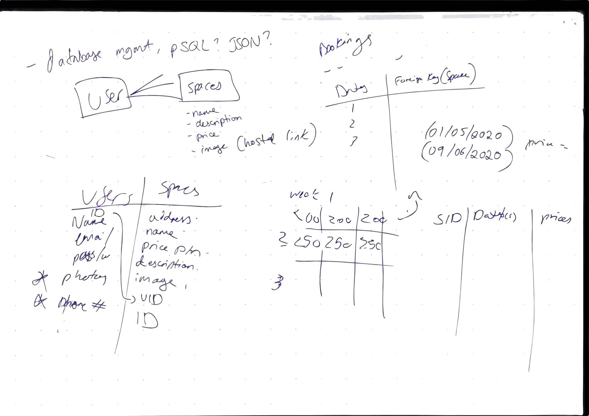

# makersbnb by The 4 Bracketeers

##
* As a user I would like to sign up for an account and login
* As a user I would like to list a new space
* As a user I would like to add additional information on my space
* As a user I would like to interact with a calendar to show my spaces availability
* As a secondary user I would like to send a notification to a primary user to rent there space
* As a primary user I would like to show when my space is unavailable for rent
* As a primary user I would like my space to be advertised until I have confirmed a booking 

## Proposed Technologies
- Javascript
- PSQL
- Jasmine
- Capybara

# Daily progress
## Monday
* Emily and Imraan will work on the first user story
* Bassel and Jake will research Node.js as the best way to implement PSQL integration
- node is highly scalable and Single threaded(only one request can be handled at one time), this makes sense for how we would use it here. in larger productions we would need multiple servers but for the project at this time node makes the most sense, node shouldnt be used for more complicated projects such as video encoding
however it may be to much time out of the project to teach to 3 people including myself and work around dev related issues we may encounter

## Monday reflection
- Database structure ready, implementation needed now
- Wireframe of web pages ready, development without style to start tomorrow
- Class models to be written tomorrow
- Integration with controller & views with aim to have 1st working version by mid Wednesday

## Tuesday reflection
- Jake and Imraan worked on the routing
- Image can be displayed onto pages
- Created multiple web pages with good functionality limited design
- Created methods to interact with db and display on the screen
- Multiple spec tests to help maintain TDD
- self.all should be functional with index.login need to create method to show for individual users
- basic calendar functionality added using jquery API, need to add submit functionality here
- API used for calendar: https://jqueryui.com/datepicker/
